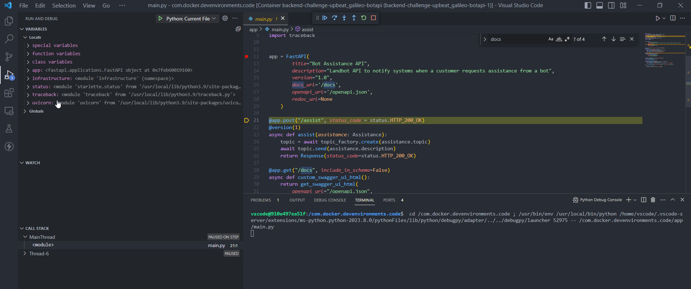
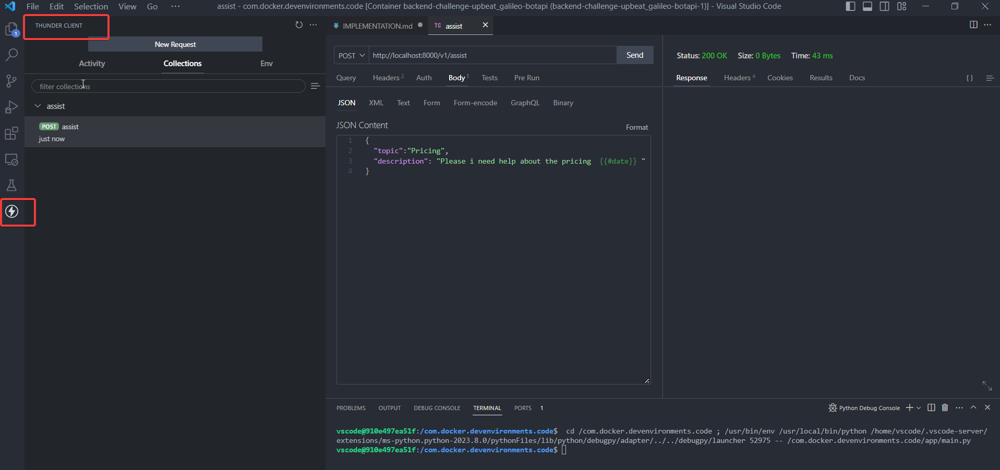

I also consider it important to follow in the code naming conventions as close as possible to the problem domain.

# Introduction

The source code implements an API I named **botassistanceapi**

I have implemented the challenge in what I consider the simplest way. Create as few external dependencies as possible hiding them using abstractions so that you can "plug in" a new tool  or change an existing one for another with the minimum possible change.

For this I have tried to follow some of the typical design patterns (strategy, repository, factory...) and principles and typical development practices (SOLID, DRY, KISS, YAGNI...). I think is also important to follow naming conventions near to the domain of the problem (botassistanceapi, topic, channels, contracts).

## Architecture

The whole API implementation is running in a single container defined in a compose file. There is a development compose file (compose-dev.yaml) and a production compose file (compose.yaml) 

With the production compose file the container is launched indepdendently of any development tool.

With the development compose file the container is actually a full Visual Studio Code Remote development environment started using a docker beta feature named development containers. Check more information at [Dev environments](https://docs.docker.com/desktop/dev-environments/).

Using these feature a full and isolated development enviroment based on Visual Studio Code can be shared among developers of the API. This is due to some extensions like the debugger (or others like [Thunder Client](https://marketplace.visualstudio.com/items?itemName=rangav.vscode-thunder-client), a Postman Like tool) are installed in the container.

## Implementation

The API is built on [FastAPI](https://fastapi.tiangolo.com/) that takes advantage of the asyncio features. The API is ready to be versioned and provides swagger available at [http://localhost:8000/v1/docs]() where there is currently a single POST endpoint.

The main.py file starts the API by means of uvicorn and it also starts an smtp server at port 3000.

Currently there are two types of channels : slack and email. Both are implemented subclassing an abstract class

Topics follow a *strategy pattern* where channels are the strategies. There are also two topics.

Topics are created by means of a factory pattern. The factory is currently using a repository.

The repository is actually an in house cache of a local csv file that is fully reloaded when the file changes.

The channel of a topic can be changed on the fly by editing the csv file.

## Improvements

The implementation can be improved in several ways :

Use more dockerized services for SMTP (currently insecure un just logs in console receide messages), Redis or a Database for a centralized configuration of the tpopic or channels.

* Authenticate the API (JWT)
* Scalability.
* Use more dockerized services for SMTP (currently insecure un just logs in console receide messages), Redis or a Database for a centralized configuration topic-channels
* Use (if it makes sense) a *fire and forget* strategy sending messages to message brokers (ActiveMQ,RabbitMQ, Kafka)
* Improve logging.
* Consider Dependency Injection (FastAPI has "Depends")
